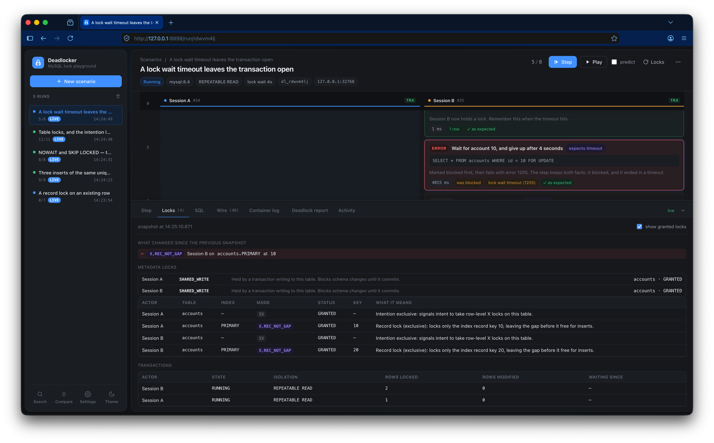
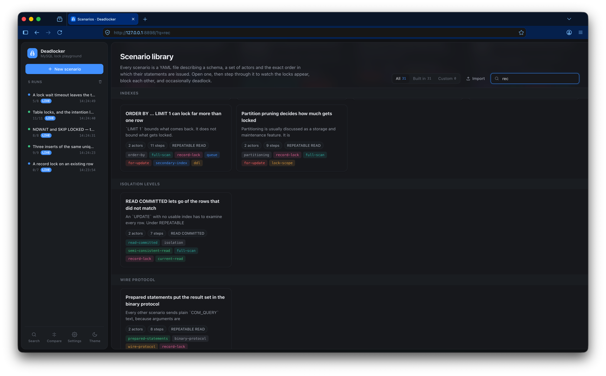
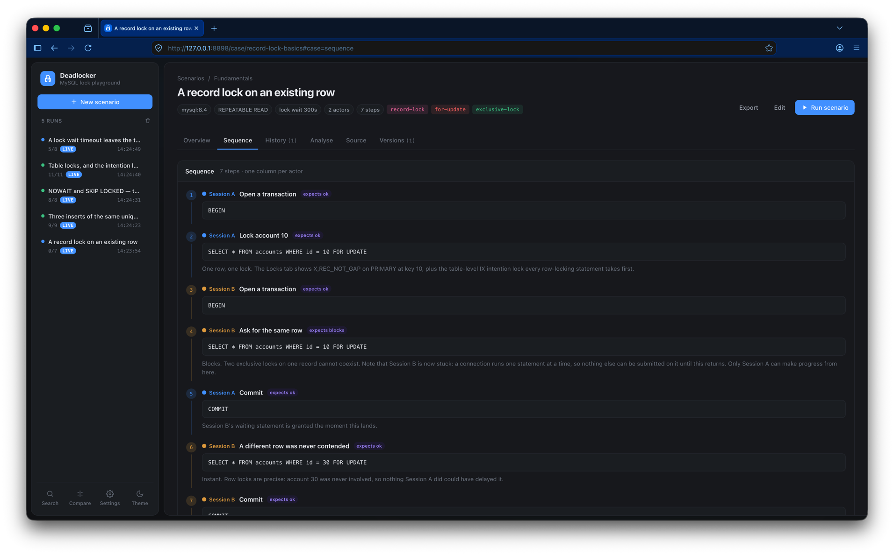
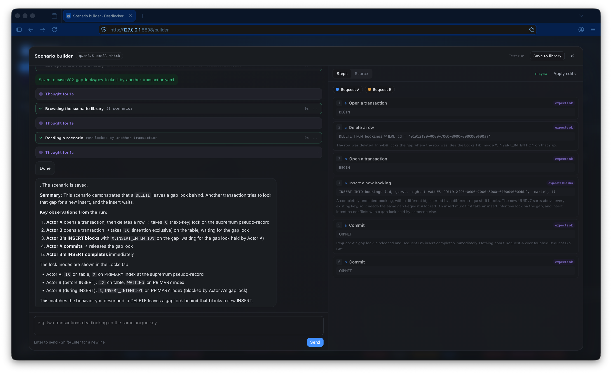
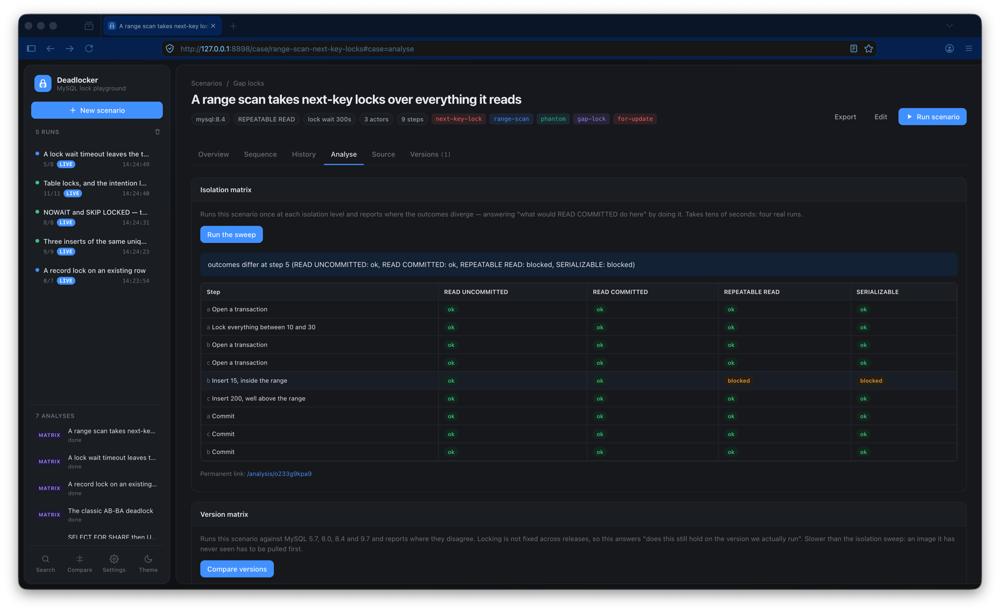

# Deadlocker

A MySQL lock playground. Write a concurrency scenario in YAML, step through it
one statement at a time, and watch — live — which locks each session takes,
who blocks whom, and exactly how a deadlock forms.

Built because "a `SELECT ... FOR UPDATE` on an id that does not exist took a gap
lock and blocked every insert" is a sentence that is much easier to believe once
you have seen it happen.



*A run in flight. One column per actor, each on its own connection; in step 5
Session B asked for a row Session A holds, was marked blocked, and four seconds
later came back as error 1205 — the step keeps both facts, and both match what
the scenario declared. Underneath, the Locks tab: what changed since the last
snapshot, the metadata locks nobody asks about, and every lock mode read back as
a sentence.*

## What it does

- **Spawns its own MySQL** in Docker (8.4 by default) and manages the whole
  lifecycle. Nothing to install, nothing left behind.
- **Steps through scenarios** with two or more simulated clients, each on its
  own dedicated connection, so transaction state persists across steps and
  statements really do run concurrently.
- **Shows the locks**, read straight out of `performance_schema.data_locks` and
  `data_lock_waits` after every step, with each lock mode translated into a
  sentence — the difference between `X`, `X,GAP`, `X,REC_NOT_GAP` and
  `X,INSERT_INTENTION` is the whole ballgame and the UI says so.
- **Draws the wait-for graph** that InnoDB's deadlock detector is looking at:
  actors as nodes, waits as labelled arrows. When the arrows close a loop it
  says so loudly — which you can actually watch happen in the
  detection-disabled scenario, where the cycle sits there for the full timeout.
- **Decodes the wire protocol.** Every connection is routed through a
  pass-through MySQL proxy that decodes each packet as it forwards it. You see
  the actual `COM_QUERY` bytes, the `OK`/`ERR` packets, the `IN_TRANS` status
  flag flipping, and a hex dump if you want it — filtered per actor and per
  step.
- **Streams the container log**, with InnoDB's `LATEST DETECTED DEADLOCK`
  report pulled out into its own tab (`innodb_print_all_deadlocks` is on).
- **Takes typed SQL** against a live run, on any actor's connection — inside
  whatever transaction it has open — or on a standalone connection you open on
  the spot. A scenario is a fixed sequence, and the question a fixed sequence
  provokes is always "what if".
- **Checks the scenario's claims.** Each step can declare `expect: blocks` or
  `expect: deadlock`; the UI marks every step as matching or not. A scenario is
  a falsifiable statement about MySQL, not a story.
- **Remembers every run** and will **diff two of them side by side**. Run a
  scenario, change one line in the playground, run it again, compare: the
  REPEATABLE READ and READ COMMITTED versions of the gap-lock case differ in
  exactly one step, and the diff shows you which.
- **Serves an MCP endpoint** so an external agent can list and author
  scenarios, start runs, step them, and read the resulting lock state.
- **Ships an optional assistant** that drives those same tools against any
  OpenAI-compatible endpoint, so it can check a claim about MySQL by running it
  rather than asserting it.

## Running it from the command line

Scenarios are executable claims about how MySQL behaves, and a claim nobody
checks rots. The `run` subcommand plays them without the UI and exits non-zero
when any step disagrees with what its scenario declares:

```sh
deadlocker run                                    # the whole library
deadlocker run classic-ab-ba-deadlock             # one scenario
deadlocker run -format junit -o results.xml       # for CI
deadlocker run -format json | jq '.scenarios[0]'
deadlocker run -isolation "READ COMMITTED" uuidv7-missing-row-gap-lock
```

`-isolation` overrides the level for every scenario named, which is the quickest
way to ask "what would READ COMMITTED do here" — the gap lock scenario above
duly fails under it, because that is the whole point of the scenario:

```
FAIL  SELECT FOR UPDATE on a missing UUIDv7 row blocks the next insert
   uuidv7-missing-row-gap-lock · READ COMMITTED · 4.8s
   !  4 b      done     Insert a brand new booking
        expected blocks, observed ok
```

The JUnit output is one testsuite per scenario and one testcase per step, so a
mismatch points at the exact statement rather than at the file. Progress goes to
stderr and the report to stdout, so piping `-format json` gives something a
parser will accept.

## Installing it

On macOS, from the tap:

```sh
brew tap jnk/deadlocker https://github.com/JNK/deadlocker
brew install --cask deadlocker
```

That installs the signed, notarized universal build published with each release
— the same `.pkg` you can download by hand from the
[releases page](https://github.com/JNK/deadlocker/releases). It writes one file,
`~/.local/bin/deadlocker`, needs no administrator password, and `brew uninstall
--cask deadlocker` takes it away again.

Or build it yourself, anywhere Go runs:

```sh
go install github.com/jnk/deadlocker/cmd/deadlocker@latest
```

## Running it

Requires Go 1.22+ to build, and a running Docker daemon to use.

```sh
go run ./cmd/deadlocker
# open http://127.0.0.1:8899
```

The first run pulls `mysql:8.4` and waits for it to initialise, which takes a
minute or so. Pressing **Run** opens the run page immediately and reports what
it is waiting for — the pull with a percentage across all layers, the container
starting, then mysqld coming up — rather than leaving a button to be stared at.
After that the container is reused, and each run just gets a fresh scratch
database that is dropped when the run closes.

The scenario library ships inside the binary but is not written to disk unless
you ask: the library page offers the import while it is empty, **Settings →
Library** offers it always, and `-seed` does it for scripts. Files that already
exist are never overwritten, so your edits are safe.

Flags:

| flag | default | meaning |
| --- | --- | --- |
| `-addr` | `127.0.0.1:8899` | address to serve the UI on |
| `-cases` | `cases` | directory of scenario YAML files |
| `-settle` | `400ms` | how long a statement may run before it is reported as blocked |
| `-prewarm` | — | boot an image at startup instead of on first run, e.g. `mysql:8.4` |
| `-keep-stale` | `false` | do not reap containers left by a previous session |
| `-state` | `~/.config/deadlocker/state.db` | bbolt file holding the versioned configuration |

Everything is embedded in the binary — templates, CSS, JavaScript. There is no
build step and no npm.

### Where state lives

Configuration — the model endpoint, the API key, the prewarm setting — and the
scenario revision history live in `~/.config/deadlocker/state.db`
(`$XDG_CONFIG_HOME` is honoured). They are per user, not per project: settings
that vanish because you started the tool from a different directory are settings
you have to set twice. A state file left over in the old per-project location is
moved there on first start.

Run history is **not** in that file and does not survive a restart. A run holds
open connections and a scratch database; the log is what you did this session,
and the honest lifetime of that is the session.

The same directory holds one lock file per running instance, which is how a
second Deadlocker — or `deadlocker run` while the UI is open — knows which
containers belong to someone else and leaves them alone.

## Using the UI



*The library, filtered to `rec`. Scenarios are grouped by category and carry
their actor count, step count, isolation level and tags; the sidebar is a live
run log, so anything still open is one click away from wherever you are.*

<kbd>⌘K</kbd> (<kbd>Ctrl K</kbd> elsewhere), or **Search** in the sidebar
footer, opens the command palette, which
searches scenarios by name, category, tag and description text, runs by id, and
analyses — plus the handful of destinations that are otherwise a click into a
menu. Ranking prefers a title prefix over a mid-word hit over a subsequence, so
typing `gap` lands on the scenario named after gap locks rather than one that
merely mentions them.

The library filters two ways at once: free text, and origin — **built in** vs
**custom**, since the shipped scenarios are documentation and your own are work.
Category headings stick as you scroll, and both filters live in the URL, so a
reload keeps them and a filtered view can be sent to someone.

**Import** a scenario by dropping a file anywhere on the library page: a bare
`.yaml`, or a `.deadlocker.json` bundle someone exported. Importing never
overwrites — a name that is taken gets a suffix. **Export** is on each scenario:
the YAML on its own, or a bundle carrying the run history and version history
too, for when the point is what it did rather than what it says.

The sidebar is a run log: it keeps up to 500 runs, shows the count, and each
row has a trash can to drop it. Removing a run that is still open closes it and
drops its scratch database, so that one asks first; a finished run is one line
in a list and goes without ceremony. **Clear** at the top empties the log but
leaves anything still running alone. Deletions are broadcast, so a second tab
does not keep offering a run that is gone.

**Compare** in the footer turns the log into a picker: tick two runs and go.
Escape backs out. "Pick different runs" on a comparison does the same thing —
the run log is where the runs are, so a second list of them was never right.

Runs that have aged out, and scenarios that have been deleted or renamed, get a
proper page rather than a bare 404 — the sidebar is still there, because what
you want next is almost always another run.

**Step** submits the next statement. **Play** runs until the scenario ends or an
actor blocks. <kbd>Space</kbd> steps, <kbd>↑</kbd>/<kbd>↓</kbd> move between
steps, <kbd>/</kbd> focuses the scenario filter. The arrow keys navigate steps
while the dock's **Step** pane is open; with any other pane open they scroll it
instead, since those panes are long lists you read rather than step through.
<kbd>j</kbd>/<kbd>k</kbd> always navigate.

The timeline is one column per actor. A step that does not return within the
settle window is marked **blocked** and left running — that is the point. Advance
the *other* actor while the first one waits, and watch what happens. When a
blocked statement eventually returns, times out, or is picked as a deadlock
victim, its card updates in place.

A blocked actor cannot accept another statement, because a real connection runs
one statement at a time. If you hit that, the scenario needs the unblocking step
to come next.

The dock at the bottom has: the selected step's result or error (with a note on
what the error actually did to your transaction), the live lock table with the
wait-for graph, a SQL console on the run's own connections, the decoded packet
stream, the container log, and the InnoDB deadlock report. It collapses to its
tab bar when you want the timeline full-height, and remembers that.

The **Locks** tab draws the wait-for graph — one node per actor, one arrow per
wait edge, the cycle highlighted when one closes. That graph *is* what InnoDB's
deadlock detector looks at, so watching a cycle appear is watching the thing
that is about to roll a transaction back.

The **Locks** tab also shows what *changed* since the previous snapshot —
locks taken, released, and moved between waiting and granted — because the
question while stepping is what the last statement did, not what is held now.
Underneath it, the transaction table carries `rows_locked` and `rows_modified`,
which is roughly what InnoDB weighs when picking a deadlock victim.

The **SQL** tab is a console on the run in front of you. Pick where a statement
goes: an actor's connection, where it lands inside that actor's open transaction
and takes locks under its name, or a standalone connection opened with **New
connection** — the difference between those two is most of what isolation means,
so both are offered rather than one being chosen for you. A standalone session
is configured exactly like an actor (same isolation level, lock wait timeout and
session variables) and appears in the lock table, the transaction list and the
wait-for graph like anything else, because a console you cannot see the effects
of would be a way to make a run lie about itself.

Statements get everything a step gets: the query plan, the settle window, the
wait explanation when they block, and the hint about what a deadlock or timeout
did to the transaction. <kbd>Enter</kbd> runs, <kbd>Shift Enter</kbd> is a
newline, <kbd>↑</kbd>/<kbd>↓</kbd> walk the history, and the packets show up in
the Wire tab filed under `console`.

**Predict mode**, beside the Step button, withholds the scenario's declared
expectation and asks you to guess before each step, then scores you. Every
scenario is already a falsifiable claim with a recorded answer; this is a switch
over data that was already there.

The **Deadlock report** tab shows `SHOW ENGINE INNODB STATUS`'s account of what
happened, syntax-highlighted: the two transactions, which locks each held and
waited for, the offending statements, and which one was rolled back. The hex
dump of the locked records — nine tenths of the raw output — is dimmed rather
than removed.

## Writing a scenario

Scenarios live in `cases/`, one YAML file each, organised into folders that
become categories. The playground (**New scenario**) is the fast path: edit,
**Run**, and only **Save** once it earns a place in the library.



*What a written scenario reads like: numbered steps, one column per actor, each
carrying the statement, what it is expected to do (`expects ok`, `expects
blocks`) and a note saying why. The tabs beside it are the same scenario as an
overview, a run history, three analyses, its YAML source, and every revision it
has been through.*

```yaml
name: SELECT FOR UPDATE on a missing row blocks the next insert
category: Gap locks          # defaults to the folder name
tags: [gap-lock, uuidv7]
description: |
  Prose shown on the scenario page.

mysql:
  image: mysql:8.4
  isolation: REPEATABLE READ   # READ UNCOMMITTED | READ COMMITTED | REPEATABLE READ | SERIALIZABLE
  lock_wait_timeout: 300       # innodb_lock_wait_timeout, per session, seconds
  deadlock_detect: true        # false turns deadlocks into timeouts, on a container of its own
  prepared: false              # true: COM_STMT_PREPARE/EXECUTE and binary result rows
  vars:                        # extra SET SESSION variables
    sql_mode: STRICT_ALL_TABLES

schema:
  - CREATE TABLE bookings (id CHAR(36) PRIMARY KEY, guest VARCHAR(64)) ENGINE=InnoDB

seed:
  - INSERT INTO bookings VALUES ('...', 'ada')

actors:
  - id: a
    name: Request A
    accent: blue               # blue | amber | violet | teal | rose
  - id: b
    name: Request B

steps:
  - actor: a
    label: Open a transaction  # defaults to a summary of the SQL
    sql: BEGIN
    note: Shown under the step in the timeline.
    expect: ok                 # ok | blocks | error | deadlock | timeout
```

`description` is rendered as Markdown on the scenario page: headings, lists,
`code`, **bold**, links, fenced blocks and pipe tables all work. A lock
compatibility matrix is a table, so tables earn their place:

```
|     | IS  | IX  | S   | X   |
|-----|-----|-----|-----|-----|
| IS  | yes | yes | yes | no  |
| IX  | yes | yes | no  | no  |
```

Alignment colons (`:--`, `:-:`, `--:`) are honoured, outer pipes are optional,
`\|` escapes a pipe inside a cell, and a row with the wrong number of cells is
padded or truncated rather than left to break the table's shape.

In the editor, moving the caret into a step lights that step up in the preview
beside it — the two panes are halves of one document, and without that they are
only related by the reader holding both in their head.

`tags` are drawn from a shared vocabulary (`internal/casedef/tags.go`), because
tags are what the library is filtered by and a taxonomy only works if everyone
spells things the same way. Left uncontrolled it grew synonyms — `mdl` beside
`metadata-lock`, `range` beside `range-scan` — and a tail of one-off
descriptions, which is a list nobody can filter by. A tag outside the vocabulary
is a lint warning, not an error: a scenario you wrote for yourself may
reasonably have its own words.

`docs` is an optional list of external references, shown beside the description
on the scenario page. Scenarios explain a behaviour; the manual defines it, and
keeping the link in the file means the two stay together:

```yaml
docs:
  - title: InnoDB Locking — gap locks
    url: https://dev.mysql.com/doc/refman/8.4/en/innodb-locking.html#innodb-gap-locks
    note: optional, one line on why it is worth reading
```

**Ordering rule.** A connection runs one statement at a time, so a blocked actor
cannot accept its next step. Put the statement that releases the lock — usually
a `COMMIT` on the other actor — before the blocked actor's next step, or the
scenario wedges itself.

The playground editor highlights YAML (and the SQL inside block scalars) and
completes keys and values with <kbd>Ctrl</kbd>+<kbd>Space</kbd>, including the
actor ids the document declares.

`expect` values:

| value | matches |
| --- | --- |
| `ok` | completed without error |
| `blocks` | hit a lock wait, whatever happened afterwards |
| `error` | any failure, including deadlock and timeout |
| `deadlock` | errno 1213, chosen as the victim |
| `timeout` | errno 1205, `innodb_lock_wait_timeout` fired |

Omit `expect` when the outcome genuinely is not deterministic — which victim
InnoDB picks in a symmetric deadlock, for instance.

`lock_wait_timeout` defaults to 300 seconds because scenarios are stepped
through by hand and a statement timing out while you read the explanation is the
wrong lesson. Set it low deliberately when the timeout *is* the lesson.

## The scenario library

The built-in scenarios are **not** written to disk on start. Filling a directory
with two dozen files nobody asked for is a decision, not a default. The library
page offers the import while it is empty; **Settings → Library** offers it
always, and never overwrites a file that is already there. `deadlocker -seed`
does the same for scripts. The same panel removes them again, deleting only the
ones still identical to what ships in the binary — a built-in you have edited is
your work, and is kept.


**Fundamentals** — record locks on an existing row · shared vs exclusive
compatibility · why a lock wait timeout leaves the transaction open and holding
locks · the intention locks behind every row lock, and what `LOCK TABLES`
collides with · `NOWAIT` and `SKIP LOCKED`, the two ways to refuse to wait ·
`ROLLBACK TO SAVEPOINT` handing back the locks taken after it, without ending
the transaction.

**Gap locks** — a `DELETE` holding the space the row used to occupy, so
re-inserting the same key blocks · the UUIDv7 case: `SELECT ... FOR UPDATE` on a missing row locks
the supremum gap and blocks every new time-ordered insert · the same scenario
under `READ COMMITTED`, where it does not · how narrow a gap lock really is ·
what a range scan locks (including one record past the range).

**Deadlocks** — the classic AB-BA cycle · check-then-insert, where two
compatible gap locks turn into a deadlock the moment both sides insert · the
three-way duplicate key deadlock caused by InnoDB's shared lock on a duplicate ·
`SELECT … FOR SHARE` followed by an `UPDATE`, where two *identical* transactions
deadlock on a lock upgrade · a foreign key doing the same thing invisibly when
you insert the child before updating the parent · two sessions both locking in
"ascending order" and still deadlocking, because their indexes disagree about
what ascending means · what happens when you disable `innodb_deadlock_detect`
(both sides time out, which is worse).

**Isolation levels** — `SERIALIZABLE` silently making every plain `SELECT` a
locking read · MVCC consistent reads never blocking and never being blocked ·
a transaction that reads 100, adds 10 and gets 210, because a plain `SELECT`
uses the snapshot and an `UPDATE` does not · `READ COMMITTED` releasing the
locks on rows its `WHERE` clause rejected.

**Indexes** — an `UPDATE` with no usable index locking every row it scans · a
secondary index lookup locking both the index entry and the clustered record ·
a foreign key making a child insert lock the parent row · `ON DELETE CASCADE`
locking every child it is about to remove · `ORDER BY … LIMIT 1` locking five
rows to return one, and the index that fixes it · `FOR UPDATE OF` locking one
side of a join instead of both · partition pruning deciding how much gets
locked.

**Metadata locks** — one idle transaction stopping `ALTER TABLE`, and every
reader queuing behind the waiting ALTER. Zero row locks involved, which is
what makes this class of stall so confusing to diagnose.

**Wire protocol** — prepared statements moving the result set into the binary
protocol, with the same locking behaviour and a completely different packet
trace.

Every scenario in the library is verified against a real server:

```sh
go run ./cmd/deadlocker run      # no server needed; exits non-zero on a mismatch

go run ./cmd/deadlocker &        # or, against a running server:
hack/verify.py                   # same checks plus the lock-mode coverage report
go run ./hack/mcpprobe           # drives the MCP server as a real client
```

`verify.py` runs each case end to end and fails if any step's observed behaviour
stops matching its declared expectation. All 32 currently pass on MySQL 8.4.11.

It also samples `performance_schema.data_locks` after every step and reports
which lock modes the library actually demonstrated. That is what backs the claim
of full coverage — not that a scenario is *named* after a gap lock, but that one
was observed while it ran:

```
lock modes observed across the library
  ok   TABLE     IS
  ok   TABLE     IX
  ok   TABLE     S
  ok   TABLE     X
  ok   RECORD    S              S,REC_NOT_GAP    S,GAP
  ok   RECORD    X              X,REC_NOT_GAP    X,GAP
  ok   RECORD    X,INSERT_INTENTION
  ok   RECORD    supremum pseudo-record
  ok   METADATA  SHARED_READ    SHARED_WRITE     EXCLUSIVE
```

The check earned its keep immediately: it caught that the table lock scenario
was demonstrating a metadata lock rather than an InnoDB table lock, because
`LOCK TABLES` only takes the latter when `autocommit` is off.

One lock type is deliberately absent. The table-level **AUTO-INC** lock cannot
be shown here: MySQL 8's default `innodb_autoinc_lock_mode = 2` never takes one,
and the variable is read-only at runtime, so a scenario cannot opt into it the
way it can opt into `autocommit = 0`.

The pure front-end logic — YAML highlighting and completion, the command
palette's ranking, and the CSS invariants that have broken before — has its own
browser-free tests, and the Markdown renderer is tested in Go:

```sh
node hack/yaml_test.js
node hack/palette_test.js
node hack/deadlock_test.js
node hack/library_test.js
node hack/css_test.js
go test ./...
```

### Things worth knowing

- **TLS is off on purpose.** The proxy can only decode the command phase in
  plaintext. Authentication still uses `caching_sha2_password`; the proxy
  forwards those packets opaquely and labels them without pretending to
  interpret RSA-encrypted bytes.
- **Statements use the text protocol.** `interpolateParams` is on, so `args`
  are interpolated client-side and every statement arrives as a readable
  `COM_QUERY` rather than a binary `COM_STMT_EXECUTE`.
- **Setup and introspection bypass the proxy** on a separate admin connection,
  so they never pollute the packet timeline.
- **`deadlock_detect` gets its own container.** MySQL only exposes it globally,
  so a scenario that turns it off runs on a server started with
  `--innodb-deadlock-detect=OFF` rather than reaching over and changing the one
  everything else is using. Setting it with `SET GLOBAL` silently converted
  every concurrent run's deadlocks into lock waits; now no run can reconfigure
  another's server, and two runs of any two scenarios are independent.
- **Teardown kills blocked connections** with `KILL CONNECTION` before closing
  them — a connection parked on a lock wait will not respond to a polite close.

## MCP

Deadlocker serves MCP over streamable HTTP at `/mcp`. External clients get the
same operations the built-in assistant uses.

```sh
claude mcp add --transport http deadlocker http://127.0.0.1:8899/mcp
```

**Tools** — `list_scenarios`, `get_scenario`, `validate_scenario`,
`create_scenario`, `update_scenario`, `list_scenario_versions`,
`get_scenario_version`, `restore_scenario_version`, `start_run`, `step_run`,
`run_all`, `get_run`, `get_locks`, `close_run`, `list_history`,
`compare_runs`.

**Resources** — `deadlocker://docs/format` (the scenario format, which an
authoring agent should read first), `deadlocker://scenarios`,
`deadlocker://history`, plus `deadlocker://scenario/{id}` and
`deadlocker://run/{id}` templates.

The design point is `step_run`: it returns each step's outcome **together with
the lock state it produced** — lock modes with plain-language explanations, wait
edges, and whether the wait graph contains a cycle. That is what lets an agent
reason about why something blocked instead of guessing.

`validate_scenario` also lints for the ordering mistake that produces a file
which parses but wedges forever:

```
step 5 gives "b" another statement while its step 4 is expected to block;
a connection runs one statement at a time, so put the releasing COMMIT
or ROLLBACK first
```

Everything an MCP client does appears live in any open browser tab, attributed
to its source.

## The built-in assistant

Optional, and hidden entirely until configured — Deadlocker is fully usable
without it. Configure it in **Settings**: an OpenAI-compatible base URL (Ollama,
LM Studio, llama.cpp, vLLM, or a remote gateway), an optional API key, and a
model chosen from a dropdown populated by querying the endpoint.



*The builder, running a local `qwen3.5-small-think`. The conversation on the
left is the model's actual tool calls — browsing the library, reading a
scenario, running it — and its summary is a report of what the run did, not a
claim about MySQL. On the right the scenario takes shape step by step, with
**Test run** to play it then and there and **Save to library** when it earns a
place — at which point it is a YAML file in `cases/` like any other.*

Two separate surfaces, because they are different jobs:

- **Discuss** — a docked bubble on a scenario or run page. Ask why something
  blocks, or propose a change and have it run the variant and report what
  actually happened. Closes freely; Escape dismisses it.
- **Build** — opened from **Build with the assistant** in the sidebar, from
  **Edit with assistant** on a scenario, or by navigating to `/builder`
  (`/builder?from=<id>` to edit one). A modal sheet with the conversation on
  one side and the scenario taking shape on the other: a step list that fills in as it is drafted, with a
  Source tab that has the same YAML highlighting and schema-aware completion as
  the playground editor. **Test run** starts the scenario and plays it to the end right there, driving
  that step list live with a stopwatch, rather than throwing you into another
  tab. While the assistant is driving a run of its own, the only control offered
  is **Stop**, which halts it and tells the model through its own tool result
  that a person intervened — so it explains itself instead of retrying.
  Runs of an unsaved draft are ephemeral: real runs, but they never appear in
  the sidebar or in a saved scenario's history. The assistant is instructed to draft, run, and correct before claiming
  anything works. This one is deliberately hard to close by accident: Escape is
  swallowed, the backdrop is inert, and closing with unsaved work asks first.

The conversation is rendered as a sequence of blocks in the order things
happened, not one bubble per turn. Reasoning streams into a windowed view about
ten lines tall and collapses to "Thought for 8s" when it closes, expandable
again. Tool calls appear the moment the model commits to one — before its arguments
have finished streaming — named for what they are doing ("Stepping the run ·
a7qfuxsp") with a running timer, and resolve to an outcome ("1 step · 1
blocked"); the raw arguments and result are one click away. Prose
is markdown, and a new bubble begins after each tool call or thought so text
either side of an interruption does not merge. While a reply is pending there is
a "Processing" bubble with its own timer, and anything you type meanwhile is
queued and sent when the turn ends.

Both drive `internal/agentapi`, the same layer behind MCP, so the two can never
drift apart. They differ deliberately in how long they last. The **builder** is
a modal task: closing it ends the conversation, and opening it again is a blank
page. The **bubble** is a running conversation about whatever is on screen, so
putting it away keeps everything and it comes back as it was — on this page and
the next one.

Configuration is stored in bbolt and versioned. Every save appends a revision;
restoring copies an old one forward rather than rewriting history, so a base URL
that used to work is always one click away.

Sampling is entirely optional — leave a field empty and nothing is sent, so the
model server's own default applies. Beyond temperature and max tokens there are
top-p, top-k, min-p, repeat/presence/frequency penalty, seed and a free-text
reasoning effort, plus a **kwargs JSON object** merged into the request body
verbatim for anything else a given server accepts. The knobs the OpenAI schema
has no field for (`top_k`, `min_p`, `repeat_penalty`, `reasoning_effort`) are
written into the body directly, because local servers take far more than the
standard schema exposes. Keys in the JSON object override the fields above it.

## Scenario versions

Scenarios are versioned the same way. Every write — from the editor, the
assistant, or an MCP client — appends a revision to bbolt with a note saying
where it came from, and the scenarios already on disk get a baseline revision at
startup. The **Versions** tab on a scenario lists them newest first, previews
any revision's YAML, and restores one in a click.

Restoring is append-only too: the restore becomes the newest revision, so
rolling back can itself be rolled back. A save whose source is unchanged is not
recorded, so re-saving an untouched file does not fill the history. An old
revision that no longer parses is refused rather than restored into a broken
file.

The YAML file on disk stays the source of truth; the store is a record of what
it used to say, not a second place to read the current scenario from.

## Starting MySQL early

Pulling and initialising MySQL takes tens of seconds the first time, and paying
that while you are waiting to see a lock is the worst possible moment for it.
**Settings → MySQL container** starts the image when the app starts instead. It
runs in its own goroutine, so the UI is up immediately either way, and a failed
pre-warm costs nothing: every run starts its own container on demand regardless.

`-prewarm` does the same thing for scripts, and overrides the setting.

## Analysis



*The isolation matrix, run on the range-scan scenario: four real runs, one per
isolation level, reduced to the one row where they disagree — the insert inside
the range blocks under REPEATABLE READ and SERIALIZABLE and sails through under
the other two. Every analysis keeps a permanent URL, and the sidebar lists the
ones already done.*

Three background analyses on every scenario's **Analyse** tab, also available as
MCP tools (`isolation_matrix`, `version_matrix`, `shrink_scenario`, polled with
`get_job`).

The **version matrix** runs the scenario against MySQL 5.7, 8.0, 8.4 and 9.7.
Locking is not fixed across releases — 5.7 predates `NOWAIT` and `SKIP LOCKED`
entirely — so this answers "does this still hold on the version we actually
run". A column that could not run says so rather than counting as agreement.

There is no arm64 `mysql:5.7` image; on Apple Silicon it is pulled as amd64 and
run under emulation, which costs about ten seconds of extra startup.

Any analysis can be aborted while it runs. Whatever finished is kept: a partial
matrix still says what those columns did, and a partial reduction has still
verified every step it dropped.

**Isolation matrix** runs the scenario once at each of the four isolation
levels and reports where the outcomes diverge — answering "what would READ
COMMITTED do here" by doing it rather than reasoning about it. On the UUIDv7
gap-lock case:

```
step                        READ UNCOMMITTED  READ COMMITTED  REPEATABLE READ  SERIALIZABLE
b Insert a brand new booking  ok                ok              blocked          blocked
```

Note that it compares whether a step *hit a lock wait*, not its final status: a
blocked step still ends "done" once the other actor commits, so final status
alone hides exactly the difference the matrix exists to show.

**Minimal reproduction** repeatedly drops steps and re-runs, keeping only those
still needed to produce the deadlock, timeout or block. It is delta debugging
against a real server — every candidate is actually executed. On the AB-BA
deadlock it goes from 8 steps to 6 in 14 attempts, correctly identifying both
cleanup steps as unnecessary.

The result shows the *original* sequence with the dropped steps struck through
rather than only the survivors: seeing what turned out to be incidental is the
point. From there the reduction can be copied, saved as a new scenario beside
the original, or written over it.

Both analyses appear in the sidebar while they run, with live progress, and
each has a permanent URL at `/analysis/{id}`.

## Query plans

Every locking statement carries its `EXPLAIN` output, read on a connection that
holds no locks of its own. Which index the optimizer picks is what decides what
gets locked, so the plan is the other half of any explanation involving a full
scan — the unindexed `UPDATE` reports `type=index, key=PRIMARY`, and the step
detail spells out what that means for locking.

`INSERT ... VALUES` is deliberately not explained: MySQL returns a dummy row for
it that would read as a full table scan and be actively misleading.

## Run history and comparison

Every run is recorded — configuration, per-step outcomes, verdicts, the final
lock snapshot and any deadlock report. Records outlive the run itself, so you
can close a run and still compare it later.

The **History** tab on a scenario lists its runs; tick two and compare. The
comparison aligns steps by number and reports only what actually changed, with
timings compared in coarse bands so millisecond jitter is not mistaken for a
behavioural difference.

History is in-memory and capped at 200 runs. Restarting the server clears it.

## How it works

```
browser ──SSE──► web (html/template + vanilla JS, embedded)
                  │
                  ▼
               engine ──── one dedicated *sql.Conn per actor
                  │    ├── lock snapshots from performance_schema
                  │    └── run history + diffing
                  │
                  ▼
           wire proxy (one listener per actor, decodes as it forwards)
                  │
                  ▼
          MySQL container (managed over the Docker socket)
```

- `internal/dockerctl` — small Docker Engine API client over the unix socket.
  The official SDK's dependency tree is not worth it for pull/create/start/logs.
- `internal/mysqlbox` — container lifecycle. One long-lived container per image,
  reused across runs; MySQL's data directory init is far too slow to pay per run.
- `internal/casedef` — the YAML format and the on-disk library.
- `internal/markdown` — the small Markdown subset scenario descriptions use.
- `internal/agentapi` — the typed operation layer plus the activity hub. The one
  place an ability is added.
- `internal/mcpserver` — MCP tools and resources over streamable HTTP.
- `internal/chat` — the assistant, on `charm.land/fantasy`.
- `internal/store` — bbolt-backed versioned configuration and scenario history.
- `internal/wire` — MySQL packet framing and a decoding pass-through proxy,
  text and binary result rows.
- `internal/engine` — run orchestration, step-through control, lock
  introspection, the event bus, run history and diffing.
- `internal/web` — server-rendered pages plus an SSE stream.

Direct dependencies: `go-sql-driver/mysql`, `gopkg.in/yaml.v3`, `go.etcd.io/bbolt`,
`github.com/modelcontextprotocol/go-sdk` and `charm.land/fantasy`. The last two
are only reachable through the MCP endpoint and the assistant; the core tool
does not depend on them at runtime.

## Ideas not built yet

- MariaDB images alongside MySQL for comparing lock semantics. MariaDB has no
  `performance_schema.data_locks`; it still ships the older
  `information_schema.INNODB_LOCKS` and `INNODB_LOCK_WAITS`, so the
  introspection layer would need a second implementation behind an interface.
- Persisting run history across restarts. Configuration is already in bbolt, so
  the storage is there; run records just are not written to it yet.
- A timeline scrubber to replay lock snapshots step by step after the fact.
- MCP prompts, so a client can offer "explain this scenario" as a slash command
  rather than the user having to phrase it.
